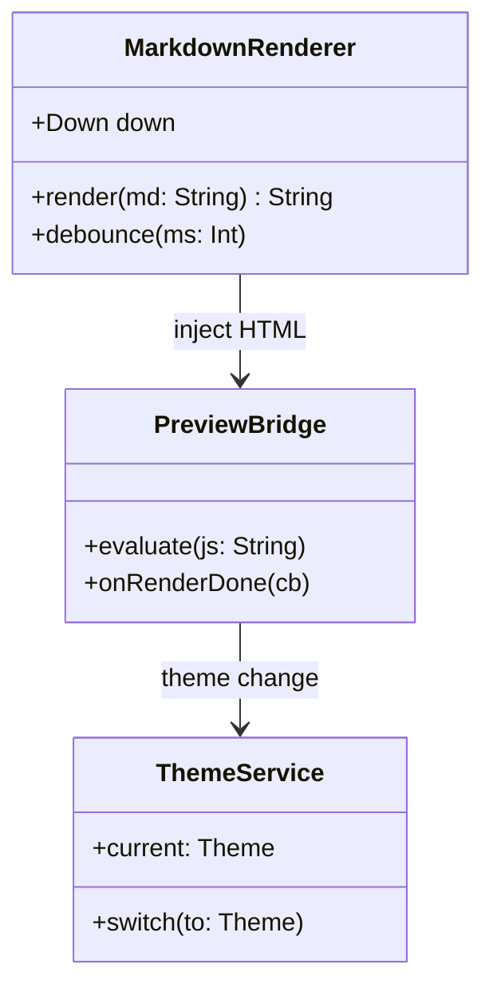

# Class Diagram Sample

```mermaid
classDiagram
    class MarkdownRenderer {
        +Down down
        +render(md: String) String
        +debounce(ms: Int)
    }
    class PreviewBridge {
        +evaluate(js: String)
        +onRenderDone(cb)
    }
    class ThemeService {
        +current: Theme
        +switch(to: Theme)
    }
    MarkdownRenderer --> PreviewBridge : inject HTML
    PreviewBridge --> ThemeService : theme change
```
