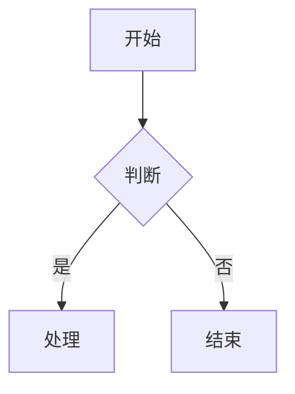
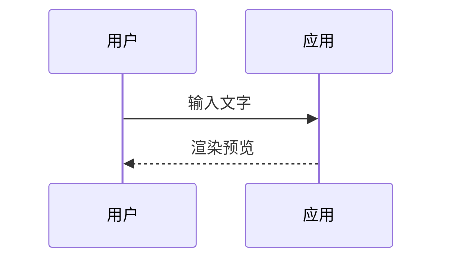
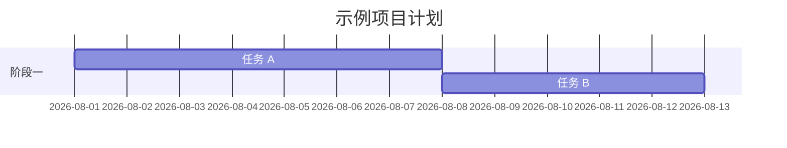
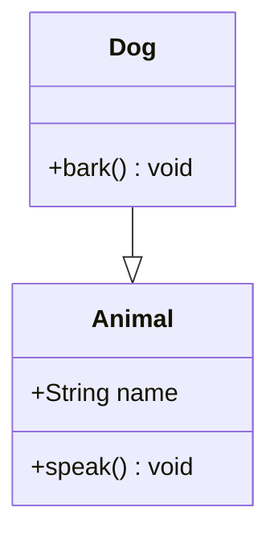
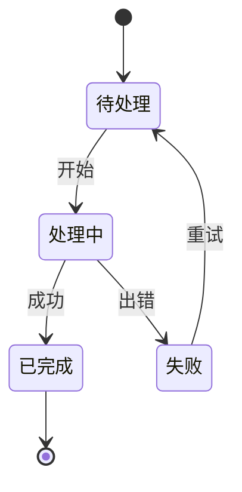
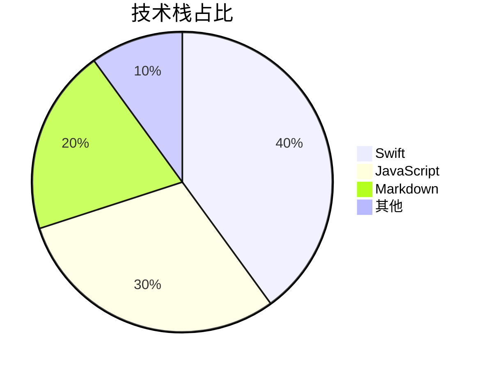

# Comprehensive Markdown 全语法验证模板

> 用途：第四轮全语法渲染验证（FR-021~045 系统性验收）。
> 验证流程：打开本文件 → 预览渲染 → 逐项对照 15 项清单 → 记录渲染验证矩阵（✅/⚠️/❌ + 现象）。

## 1. 标题 1-6 级 / Headings H1-H6

# H1 一级标题
## H2 二级标题
### H3 三级标题
#### H4 四级标题
##### H5 五级标题
###### H6 六级标题

## 2. 段落 / 硬换行 / 中英文混排 / Paragraphs

这是第一段中文段落，包含 English words 中英混排，验证默认排版与字体回退。
第二行使用行尾两个空格硬换行。  
第三行继续（硬换行生效则与第二行同行不同段）。

## 3. 粗体 / 斜体 / 删除线 / 行内代码 / Inline styles

**粗体 bold**、*斜体 italic*、***粗斜体 both***、~~删除线 strikethrough~~、`行内代码 inline code`。

## 4. 链接 / 图片 / 自动链接 / Links

[内链示例](https://example.com) 与 [带标题链接](https://example.com "title")。
自动链接 https://example.com 应被识别（GFM autolink——⚠️ fork 无扩展，需验证）。


## 5. 引用块 / Blockquotes

> 一级引用。
>
> > 二级嵌套引用。
> > 继续嵌套内容。
>
> 回到一级引用。

## 6. 有序 / 无序列表 / Lists

1. 有序第一项
2. 有序第二项
   1. 嵌套有序
   2. 嵌套有序二
3. 有序第三项

- 无序项 A
- 无序项 B
  - 二级缩进
    - 三级缩进
- 无序项 C

## 7. 任务列表 / Task lists

- [ ] 未完成任务
- [x] 已完成任务
- [X] 大写已完成

## 8. 表格 / Tables

| 左对齐 | 居中 | 右对齐 | 空单元格 |
| :--- | :---: | ---: | --- |
| A1 | B1 | C1 | |
| A2 | B2 | C2 | D2 |
| 行内 `code` | **粗体** | [链接](https://example.com) | E4 |

## 9. 分隔线 / 转义字符 / HR + Escapes

---

\*星号不转斜体\*、\# 井号不转标题、\| 管道不转表格、\~ 波浪线不转删除线。

## 10. 代码块 / Code blocks

```swift
func greet(name: String) -> String {
    return "Hello, \(name)!"
}
```

```javascript
function greet(name) {
  return `Hello, ${name}!`;
}
```

```python
def greet(name: str) -> str:
    return f"Hello, {name}!"
```

```json
{ "greeting": "Hello", "name": "world" }
```

## 11. LaTeX 公式 / Math

行内公式：质能方程 $E = mc^2$。
块级公式：

$$\int_0^1 x^2 \, dx = \frac{1}{3}$$

### 11.2 LaTeX 专项验收样例（L1-L10）

> 验收：预览渲染本区 → 对照 L1-L10 逐项核验 → 将 LaTeX 专项验收矩阵（✅/⚠️/❌ + 现象）输出到执行报告（矩阵模板见 batch-02 T2.4）。

**L1 行内公式 `$...$`：** 质能方程 $E=mc^2$ 是核心公式。

**L2 块级公式 `$$...$$`：**

$$\int_0^\infty e^{-x^2} dx = \frac{\sqrt{\pi}}{2}$$

**L3 `\(...\)` 分隔符：** 勾股定理 \\(a^2 + b^2 = c^2\\)。

**L4 分数 / 根号 / 上下标：** $\frac{a}{b}$、$\sqrt[3]{x}$、$x_i^2$。

**L5 希腊字母 / 运算符：** $\alpha + \beta = \gamma$、$\sum_{i=1}^n i$、$\prod_{i=1}^n i$、$\lim_{x\to 0} \frac{\sin x}{x}$。

**L6 矩阵：**

$$\begin{pmatrix} a & b \\\\ c & d \end{pmatrix}$$

**L7 分段函数：**

$$f(x) = \begin{cases} x^2 & x \ge 0 \\\\ -x & x < 0 \end{cases}$$

**L8 矢量 / 集合：** $\vec{v}$、$\hat{a}$、$\bar{x}$、$x \in A$、$A \subset B$、$A \cup B$。

**L9 错误公式容错（throwOnError:false）：** $E=mc^2$（正确）与 $\frac{}{}$（故意错误）——预期：正确公式渲染、错误公式原文保留、不崩溃。

**L10 主题联动：** 切换 dark/light 主题 → 本区公式颜色跟随（不消失、不变色异常）。

## 12. Mermaid 图表 / Diagrams

### 12.1 flowchart



### 12.2 sequence



### 12.3 gantt



### 12.4 classDiagram



### 12.5 stateDiagram



### 12.6 pie



## 13. raw HTML / Raw HTML

<div style="color: red;">红色 div 块</div>
行内 <span style="background: yellow;">黄色 span</span> 与文字混排。
<!-- ⚠️ Down safe 模式默认移除 raw HTML——预期不渲染，记录已知行为 -->

## 14. 脚注 / Footnotes

带脚注的文字[^1]，第二处引用[^2]。

[^1]: 脚注一内容。
[^2]: 脚注二内容。
<!-- ⚠️ Down-gfm fork 无 GFM 扩展——脚注语法大概率原样输出，记录已知限制 -->

## 15. 特殊字符 / Special characters

&lt; 小于 &gt; 大于 &amp; 与号 &quot; 引号 — 应显示为 < > & "。
代码内特殊字符：`<div> & <span>` 不应被转义为 HTML。
