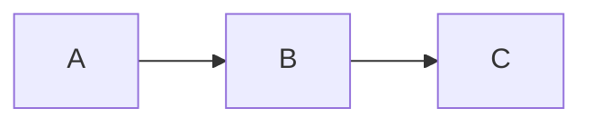
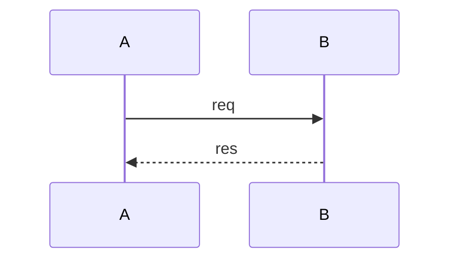
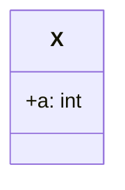
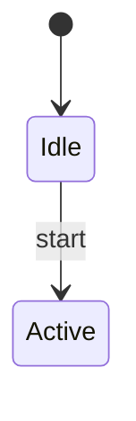
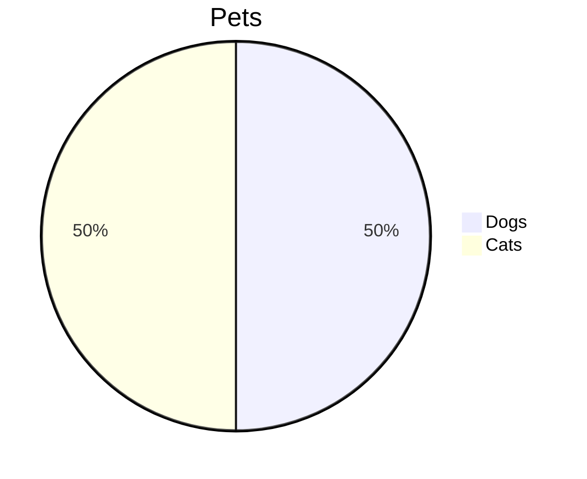
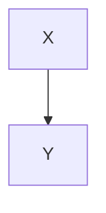
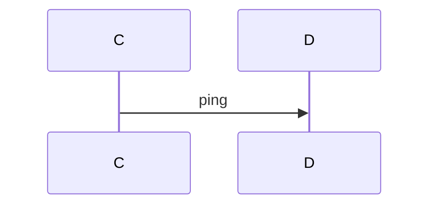
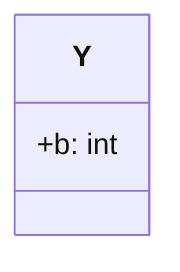
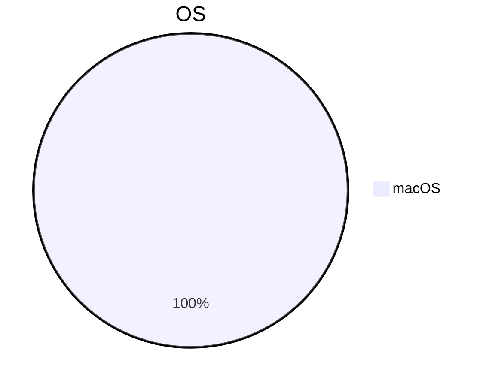

# Multi-Mermaid Heavy Document（R-M4 测试）

> 此文档含 12 个 Mermaid 图，用于 S-003 验证多图表场景下增量更新的重渲染闪烁（R-M4）。

## 1. 流程图

## 2. 时序图

## 3. 甘特图

## 4. 类图

## 5. 状态图

## 6. 饼图

## 7. 流程图 2

## 8. 时序图 2

## 9. 甘特图 2

```mermaid
gantt
    title Q
    dateFormat X
    section S2
    t2 :0, 2
```

## 10. 类图 2

## 11. 状态图 2

## 12. 饼图 2

