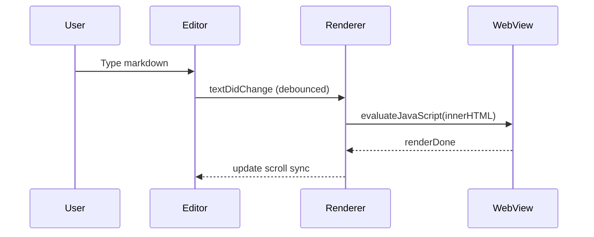

# Sequence Diagram Sample

```mermaid
sequenceDiagram
    participant U as User
    participant E as Editor
    participant R as Renderer
    participant W as WebView
    U->>E: Type markdown
    E->>R: textDidChange (debounced)
    R->>W: evaluateJavaScript(innerHTML)
    W-->>R: renderDone
    R-->>E: update scroll sync
```
