# Markdown 综合效果测试文档

> 本测试文档包含 Markdown 全部格式、10 种 Mermaid 图表、大量 LaTeX 公式，用于验证 MarkdownEditor 渲染效果。

---

## 1. 标题层级

# 一级标题 H1
## 二级标题 H2
### 三级标题 H3
#### 四级标题 H4
##### 五级标题 H5
###### 六级标题 H6

---

## 2. 文本样式

**粗体文字** *斜体文字* ***粗斜体*** ~~删除线~~ `行内代码` <u>下划线</u> 上标^2 下标~2~

> 引用块：Markdown 是一种轻量级标记语言。
> 多行引用 **支持嵌套格式**
>
> > 二级引用
> > - 引用内列表

---

## 3. 列表

### 无序列表
- 苹果
- 香蕉
  - 黄色香蕉
  - 绿色香蕉
- 橙子

### 有序列表
1. 第一步
2. 第二步
   1. 子步骤 A
   2. 子步骤 B
3. 第三步

### 任务列表
- [x] 已完成
- [ ] 待完成
- [ ] 另一个待办

---

## 4. 链接与图片

[外部链接 - 百度](https://www.baidu.com)

[内部锚点](#8-mermaid-图表)

自动链接：https://www.apple.com

图片：

---

## 5. 代码块（10 种语言）

### Swift
```swift
import Foundation

struct User: Codable, Identifiable {
    let id: Int
    let name: String
    func greeting() -> String { "Hello, \(name)!" }
}

let user = User(id: 1, name: "Alice")
print(user.greeting())
```

### Python
```python
import asyncio

async def fetch(url: str) -> dict:
    async with aiohttp.ClientSession() as s:
        async with s.get(url) as r:
            return await r.json()

async def main():
    data = await asyncio.gather(*(fetch(u) for u in urls))
    print(data)
```

### JavaScript
```javascript
const users = [{ name: 'Alice', age: 28 }];
const adults = users
  .filter(u => u.age >= 18)
  .map(u => ({ ...u, adult: true }));
console.table(adults);
```

### TypeScript
```typescript
interface ApiResponse<T> {
  status: number;
  data: T;
}
class ApiClient {
  constructor(private baseUrl: string) {}
  async get<T>(path: string): Promise<T> {
    const res = await fetch(`${this.baseUrl}${path}`);
    return res.json() as Promise<T>;
  }
}
```

### Go
```go
package main

import (
	"fmt"
	"sync"
)

func main() {
	var wg sync.WaitGroup
	for i := 0; i < 5; i++ {
		wg.Add(1)
		go func(n int) { defer wg.Done(); fmt.Println(n * n) }(i)
	}
	wg.Wait()
}
```

### Rust
```rust
use std::collections::HashMap;

#[derive(Debug)]
struct Config { name: String, workers: u32 }

fn main() {
    let mut map = HashMap::new();
    map.insert("k1", Config { name: "app".into(), workers: 4 });
    println!("{:?}", map.get("k1"));
}
```

### Java
```java
import java.util.*;
import java.util.stream.*;

public class Main {
    public static void main(String[] args) {
        List<String> names = List.of("Alice", "Bob");
        names.stream().map(String::toUpperCase).forEach(System.out::println);
    }
}
```

### C
```c
#include <stdio.h>
#include <stdlib.h>

typedef struct { int x; int y; } Point;

int main() {
    Point* p = malloc(sizeof(Point));
    p->x = 10; p->y = 20;
    printf("(%d, %d)\n", p->x, p->y);
    free(p);
    return 0;
}
```

### C++
```cpp
#include <iostream>
#include <vector>
#include <algorithm>

int main() {
    std::vector<int> v = {5, 2, 8, 1};
    std::sort(v.begin(), v.end());
    for (int n : v) std::cout << n << " ";
    return 0;
}
```

### SQL
```sql
SELECT u.name, COUNT(o.id) AS cnt
FROM users u
LEFT JOIN orders o ON u.id = o.user_id
GROUP BY u.id
HAVING COUNT(o.id) > 5
ORDER BY cnt DESC;
```

---

## 6. 行内 LaTeX 公式

行内：$E = mc^2$，$e^{i\pi} + 1 = 0$，$\alpha + \beta = \gamma$，$\sqrt{x^2 + y^2}$，$\frac{a}{b}$，$\sum_{i=1}^{n} i$，$\int_0^\infty e^{-x} dx = 1$，$\lim_{x \to 0} \frac{\sin x}{x} = 1$

---

## 7. 块级 LaTeX 公式

### 欧拉恒等式
$$
e^{i\pi} + 1 = 0
$$

### 泰勒级数
$$
e^x = \sum_{n=0}^{\infty} \frac{x^n}{n!} = 1 + x + \frac{x^2}{2!} + \frac{x^3}{3!} + \cdots
$$

### 傅里叶变换
$$
F(\omega) = \int_{-\infty}^{\infty} f(t) e^{-i\omega t} dt
$$

### 拉普拉斯变换
$$
F(s) = \int_0^{\infty} f(t) e^{-st} dt
$$

### 正态分布
$$
f(x) = \frac{1}{\sigma\sqrt{2\pi}} e^{-\frac{(x-\mu)^2}{2\sigma^2}}
$$

### 麦克斯韦方程组
$$
\nabla \cdot \mathbf{E} = \frac{\rho}{\varepsilon_0}, \quad \nabla \cdot \mathbf{B} = 0
$$

$$
\nabla \times \mathbf{E} = -\frac{\partial \mathbf{B}}{\partial t}, \quad \nabla \times \mathbf{B} = \mu_0\mathbf{J} + \mu_0\varepsilon_0\frac{\partial\mathbf{E}}{\partial t}
$$

### 矩阵运算
$$
\begin{pmatrix} a & b \\\\ c & d \end{pmatrix}
$$

$$
\begin{bmatrix} 1 & 2 \\\\ 3 & 4 \end{bmatrix}
=
\begin{vmatrix} x & y \\\\ z & w \end{vmatrix}
$$

### 多行对齐公式
$$
\begin{aligned}
(a+b)^2 &= a^2 + 2ab + b^2 \\\\
(a-b)^2 &= a^2 - 2ab + b^2 \\\\
a^2 - b^2 &= (a+b)(a-b)
\end{aligned}
$$

### 分段函数
$$
f(x) = \begin{cases} x^2 & \text{if } x > 0 \\\\ 0 & \text{if } x = 0 \\\\ -x^2 & \text{if } x < 0 \end{cases}
$$

### 求和与极限
$$
\sum_{k=1}^{n} k = \frac{n(n+1)}{2}, \quad \sum_{k=1}^{n} k^2 = \frac{n(n+1)(2n+1)}{6}
$$

$$
\lim_{x \to \infty} \left(1 + \frac{1}{x}\right)^x = e
$$

### 希腊字母与符号
$$
\alpha \beta \gamma \delta \epsilon \zeta \eta \theta \lambda \mu \pi \rho \sigma \tau \phi \chi \psi \omega
$$

$$
\forall x \in \mathbb{R}, \quad \exists y : y^2 = x \quad (x \ge 0)
$$

### 根号与分数
$$
\sqrt[3]{27} = 3, \quad \frac{1}{\frac{1}{a} + \frac{1}{b}} = \frac{ab}{a+b}
$$

### 三角函数与双曲函数
$$
\sin^2\theta + \cos^2\theta = 1, \quad \tan\theta = \frac{\sin\theta}{\cos\theta}
$$

$$
\sinh x = \frac{e^x - e^{-x}}{2}, \quad \cosh x = \frac{e^x + e^{-x}}{2}
$$

### 概率与统计
$$
P(A \cup B) = P(A) + P(B) - P(A \cap B)
$$

$$
\mu = \frac{1}{N}\sum_{i=1}^{N} x_i, \quad \sigma^2 = \frac{1}{N}\sum_{i=1}^{N}(x_i - \mu)^2
$$

### 数论
$$
\binom{n}{k} = \frac{n!}{k!(n-k)!}
$$

$$
\gcd(a, b) \cdot \operatorname{lcm}(a, b) = |ab|
$$

---

## 8. Mermaid 图表

### 流程图（Flowchart TD）
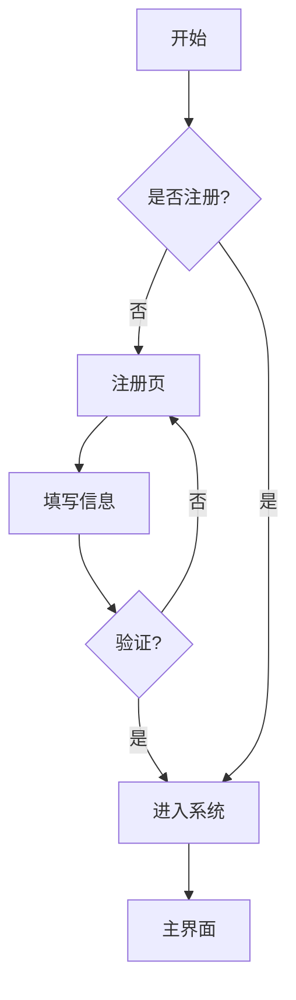

### 流程图（Flowchart LR）
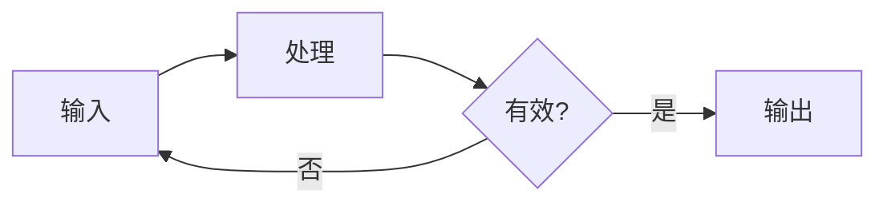

### 时序图
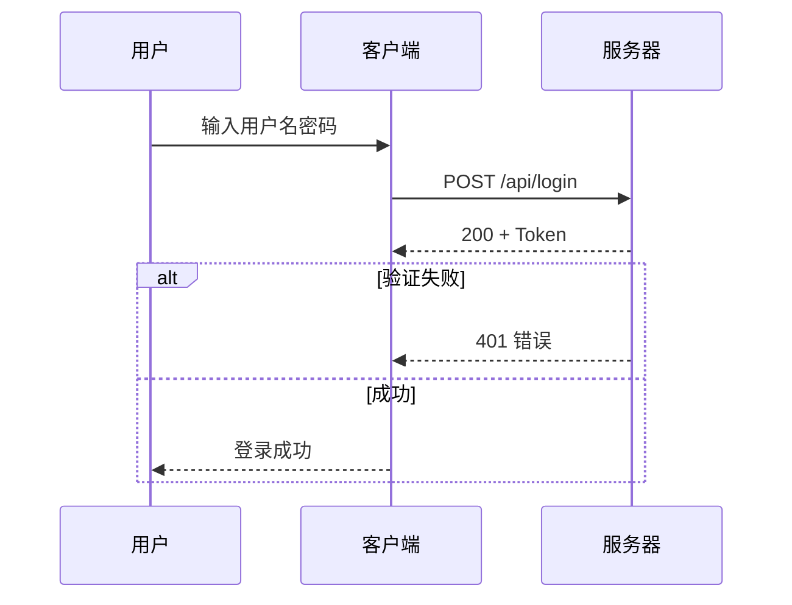

### 甘特图
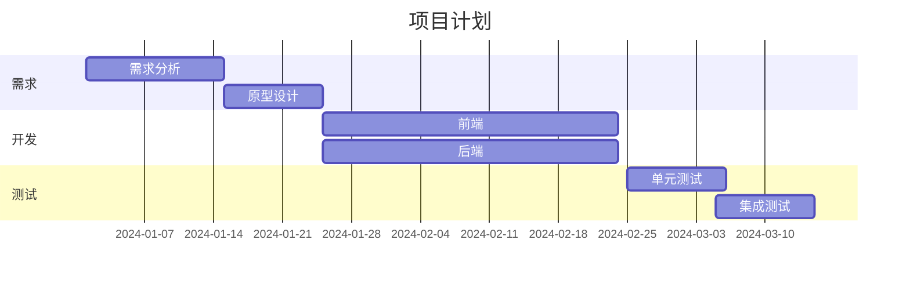

### 类图
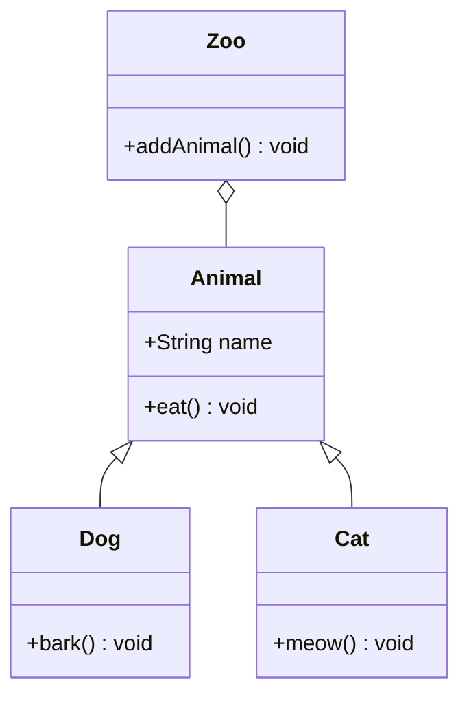

### 状态图
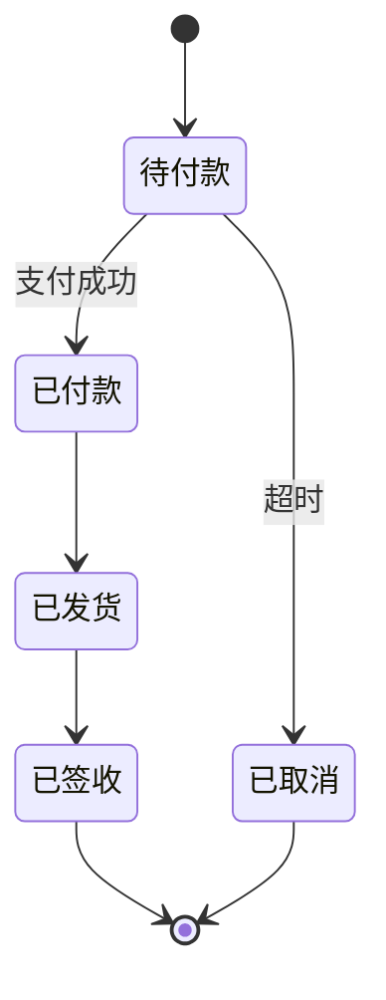

### 饼图
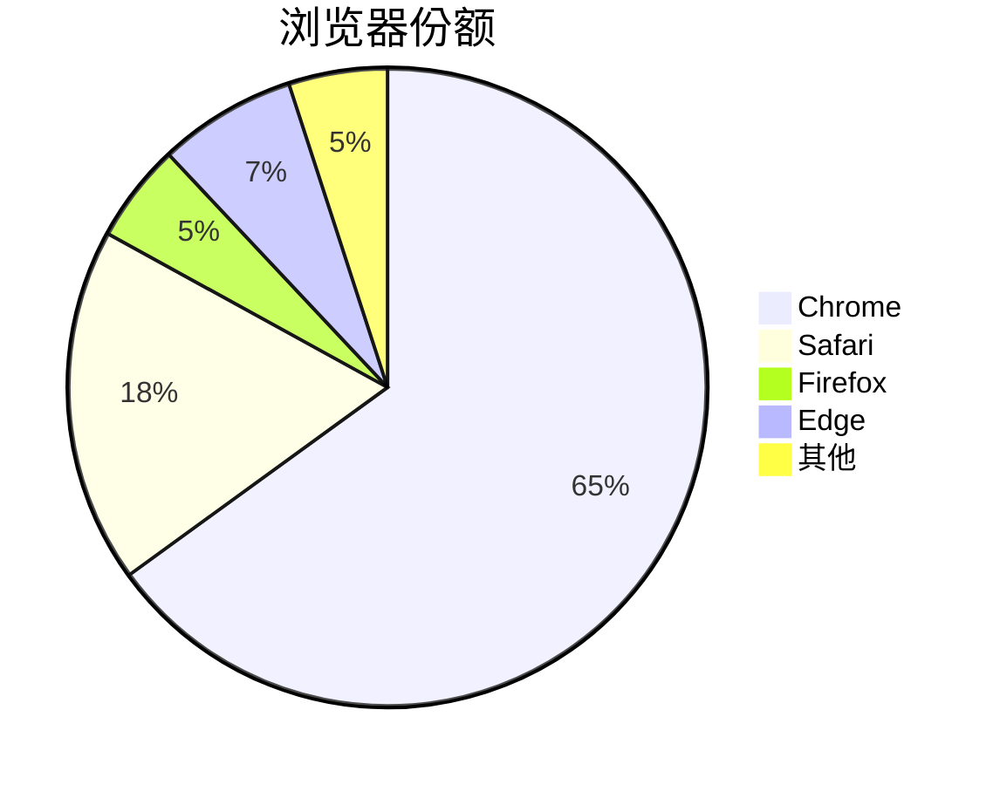

### 用户旅程图
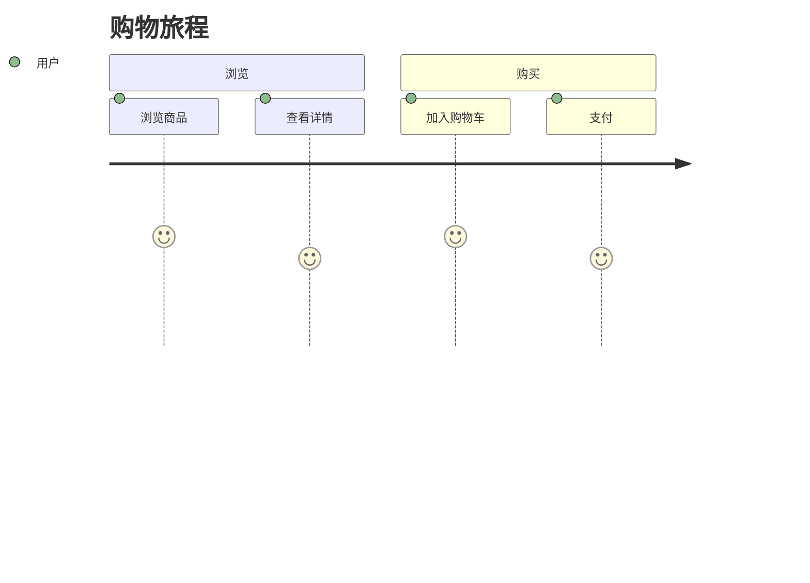

### ER 关系图
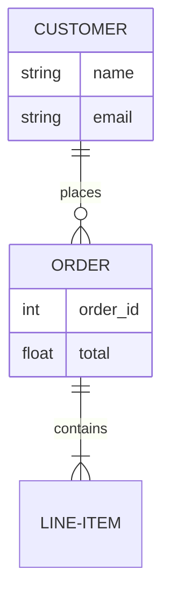

### 象限图（英文，Mermaid 限制）
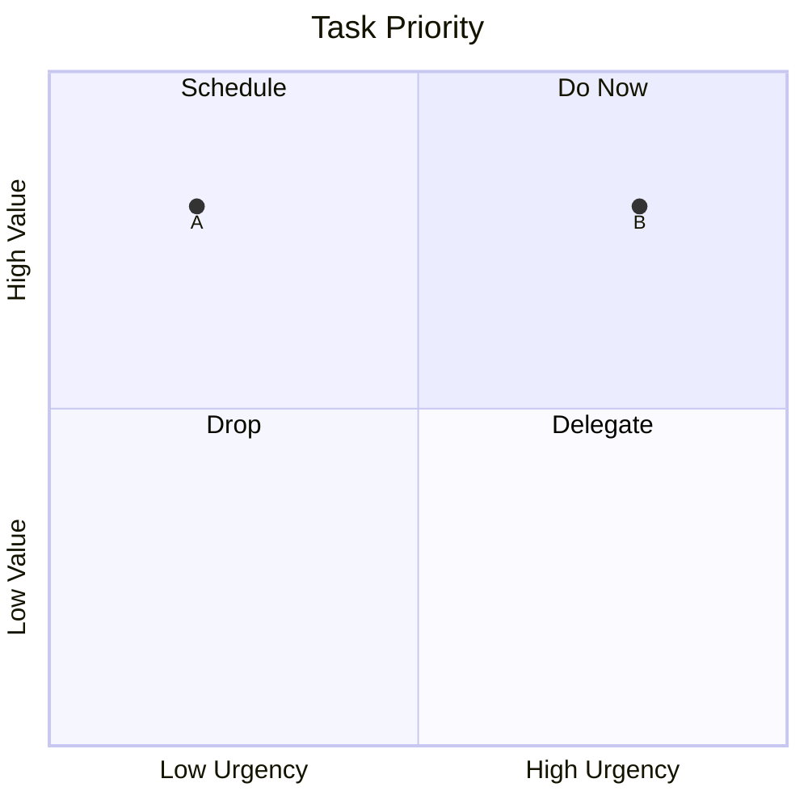

### 时间线
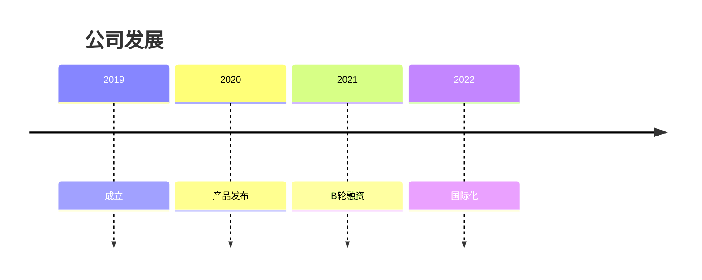

---

## 9. 表格

### 基本表格
| 名称 | 类型 | 价格 | 库存 |
|------|------|------|------|
| 苹果 | 水果 | ¥5.00 | 120 |
| 香蕉 | 水果 | ¥3.50 | 80 |
| 牛奶 | 饮品 | ¥12.00 | 45 |

### 对齐表格
| 左对齐 | 居中 | 右对齐 |
|:-------|:----:|-------:|
| left | center | right |
| 1 | 2 | 3 |

### 复杂表格
| 项目 | 状态 | 进度 | 负责人 |
|:-----|:----:|:----:|:------:|
| **前端重构** | ✅ 完成 | 100% | Alice |
| *后端优化* | 🔄 进行中 | 65% | Bob |
| `代码规范` | ✅ 完成 | 90% | Dave |

---

## 10. 特殊语法

### 分隔线

---

### 脚注
这是一个带脚注的句子[^1]，还有另一个[^2]。

[^1]: 第一个脚注内容说明。
[^2]: 第二个脚注，支持多行说明。

### 转义字符
\* 星号 \_ 下划线 \# 井号 \` 反引号

---

## 11. 嵌套组合

> **嵌套引用**
> - 列表项 1
> - 列表项 2
>
> > 二级嵌套引用

**粗体中的*斜体*和`代码`** 以及 ~~删除线~~ 组合。

---

## 12. 错误语法容错

### 错误 Mermaid（应显示错误提示）
```mermaid
graph L-R
    A --> B
```

### 错误 LaTeX（应显示错误标记）
$$
\fracc{a}{b}
$$

### 未闭合代码块（应容错）
```
未闭合的代码块
没有结束标记

**未闭合粗体（容错）

---

*文档结束。*
